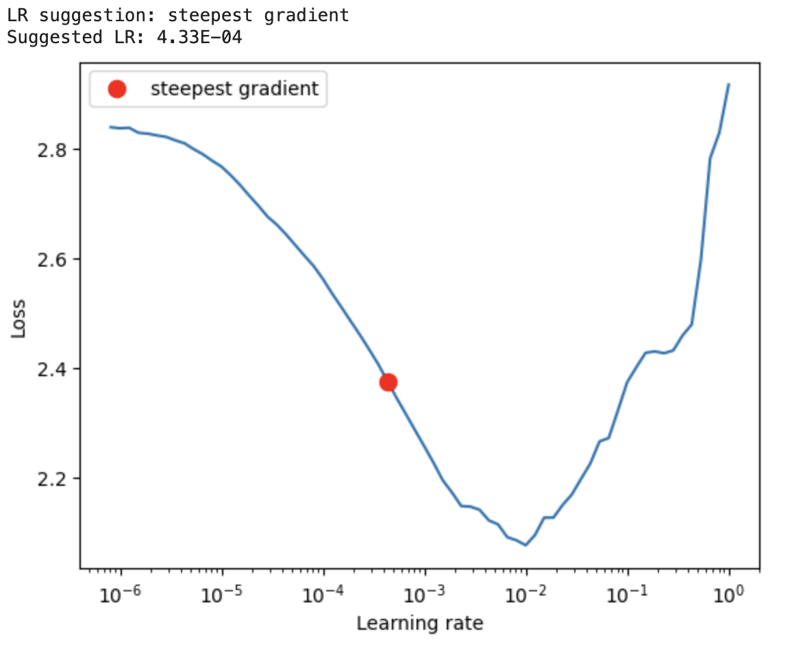
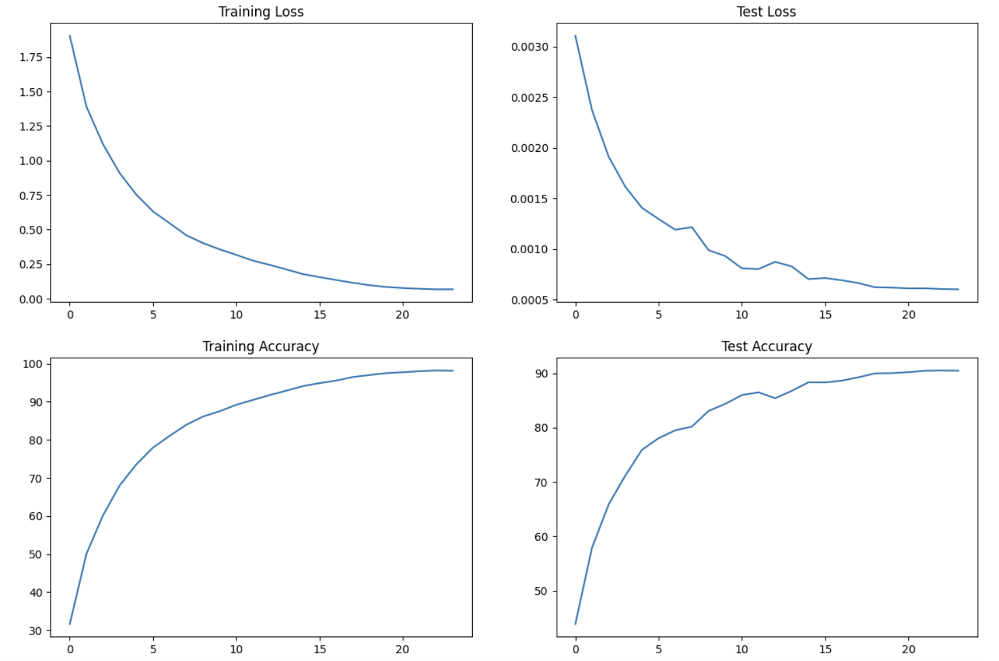

## Brief Description of Classes and Their Functions

### Cifar10SearchDataset:
- Inherits from torchvision.datasets.CIFAR10 and overrides the __getitem__ method to apply transformations on the images.
- Transforms images and returns them along with their labels.

### LoadDataset:
- Initializes the dataset loading process and checks for CUDA and MPS availability.
- Provides methods to fetch training and testing data loaders along with their transformations.

### VisualizeData:
- Contains methods to visualize images from the dataset.
- visualize: Takes a data loader and displays a batch of images along with their labels.

### LearningRateFinder:
- Utilizes the LR Finder technique to find an optimal learning rate for the model.
- findLR: Finds the optimal learning rate using LR Finder.
- visualizeLR: Visualizes the learning rate range test results.

### TrainTest:
- Manages the training and testing processes of the model.
- train: Performs training for one epoch.
- test: Evaluates the model on the test set.
- GetCorrectPredCount: Calculates the number of correct predictions in a batch.
- visualizeLoss: Visualizes the training and testing losses and accuracies over epochs.

These classes collectively provide functionalities for loading data, visualizing data, finding optimal learning rate, and training/testing the neural network model. They are designed to facilitate the experimentation and evaluation process in the context of image classification tasks using the CIFAR-10 dataset.

## Model Parameters:
- The total number of trainable parameters in the model is 6,574,410.
- The majority of parameters are associated with convolutional layers due to their large kernel sizes and output channels.

## Learning Rate Finder:
- The LR Finder technique suggests a learning rate of 4.33E-04 as the steepest gradient point.
- This learning rate suggestion can serve as a starting point for fine-tuning the model's learning rate during training.

## Training and Testing Performance:
- The accuracy steadily increases over epochs, reaching 90.45% after 24 epochs.
- Both training and testing losses decrease consistently, indicating effective learning and generalization capabilities of the model.

## Training Dynamics:

- The training and testing accuracies increase steadily with each epoch, indicating that the model is effectively learning the underlying patterns in the data.
- The learning curve shows no signs of overfitting, as the testing accuracy closely tracks the training accuracy throughout the training process.
- The model converges to a high level of accuracy without significant fluctuations, suggesting stable training dynamics and effective optimization.

## Optimization and Generalization:
- The use of techniques such as batch normalization, data augmentation (e.g., random cropping, horizontal flipping, dropout), and residual connections contribute to the optimization and generalization capabilities of the model.
- These techniques help in stabilizing training, preventing overfitting, and improving the model's ability to generalize to unseen data.
