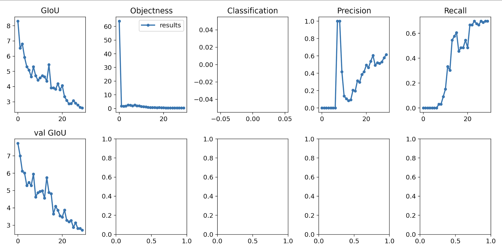
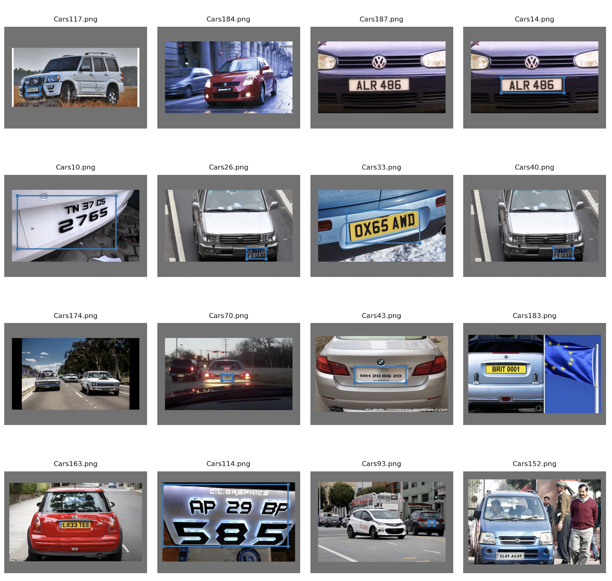

# YOLO Custom Training

Utilised Yolo model for custom training on identification of License plate from car images

## Dataset

- Total annotated images = 200
- Training samples = 180
- Test samples = 20

## Training 

**Training Batch Images:**

**Training Logs:**

## Results

### Test Sample results

## References

- https://github.com/theschoolofai/YoloV3
- https://github.com/miki998/YoloV3_Annotation_Tool
