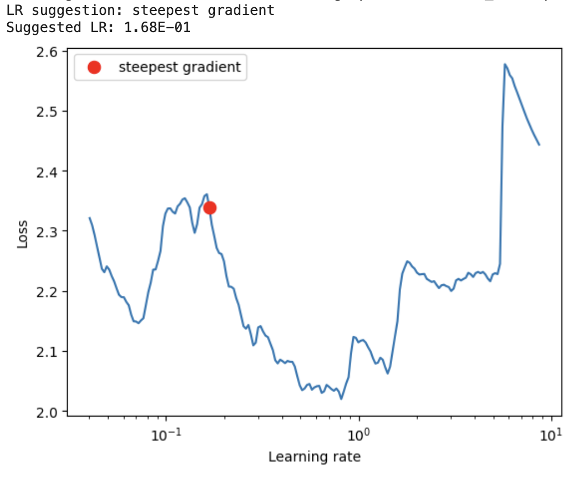

# ResNet Implementation for CIFAR-10 Classification using PyTorch Lightning

This repository contains an implementation of ResNet (Residual Neural Network) for CIFAR-10 classification using PyTorch Lightning. ResNet is a deep learning architecture known for its effectiveness in training very deep neural networks. PyTorch Lightning is a lightweight PyTorch wrapper that simplifies the training process and provides various utilities for research and production-level training.

## Project Structure

- **ERAV2_S13_Lightning**: This Python script contains the implementation of the ResNet model, dataset preparation using PyTorch Lightning's LightningDataModule, training, validation, and testing routines.
- **ERAV2_S13_Gradio**: This script utilised model trained in Lightning script to provider a visual interface for testing the model.

## Requirements
To run this code, you need the following dependencies:

- PyTorch
- PyTorch Lightning
- TorchVision
- NumPy
- Matplotlib
- Albumentations

## Lightning Modules
This project heavily utilizes PyTorch Lightning modules for training ResNet on the CIFAR-10 dataset. Here's how PyTorch Lightning modules are used:

- **pl.LightningDataModule**: This module is used for organizing data loading and preprocessing. In this project, CIFAR10DataModule is subclassed from pl.LightningDataModule to prepare and load the CIFAR-10 dataset efficiently.
- **pl.LightningModule**: This module encapsulates the model, training loop, validation loop, and testing loop. The ResNet class in this project is a subclass of pl.LightningModule. It defines the model architecture, loss functions, training and validation steps, and configuration of optimizers and learning rate schedulers.
- **Callbacks**: PyTorch Lightning provides various callbacks for monitoring and controlling the training process. In this project, LearningRateMonitor is used to log and visualize the learning rate during training.

## Learning Rate

Using torch-lr-finder   

## Results

### Training Performance
The model was trained for 20 epochs on the CIFAR-10 dataset using a batch size of 512. The training logs show the following metrics:

- Final Validation Accuracy: 80.83%
- Final Validation Loss: 0.846

During training, the validation accuracy steadily increased, indicating that the model was learning to generalize well to unseen data. The validation loss also decreased over epochs, suggesting that the model's predictions aligned better with the ground truth labels.

### Test Performance
After training, the model's performance was evaluated on the test dataset. The test logs report the following metrics:

- Test Accuracy: 80.83%
- Test Loss: 0.846

The test accuracy and loss are consistent with the validation metrics, indicating that the model generalizes well to unseen data. This performance demonstrates the effectiveness of the ResNet architecture for image classification tasks on the CIFAR-10 dataset.

The model achieved competitive performance, achieving over 80% accuracy on both the validation and test sets. These results validate the effectiveness of the ResNet architecture and the training strategy employed in this project.

### Loss Graph

## Misclassified Images

