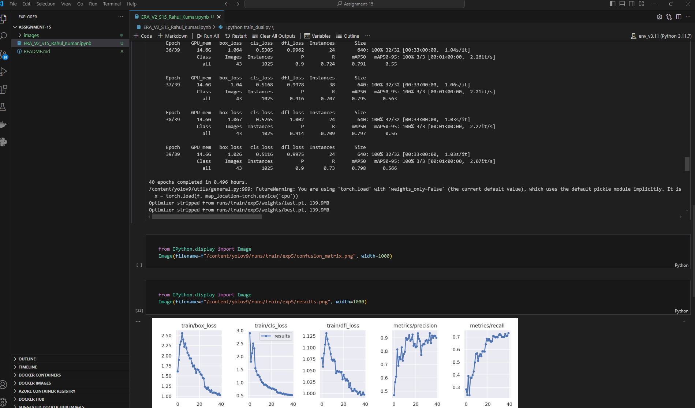
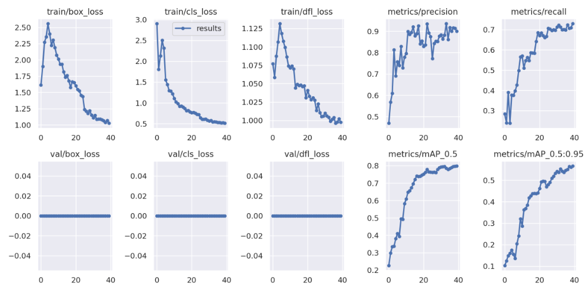

# Stamp Detection using YoloV9 

This repository shows how to custom train your model using YOLOV9.

The script above uses a football players dataset to implement the process of custom training due to confidentiality with respect to the stamp dataset (PII information).
However the same script can be used traing using custom dataset.

## Steps

1.) Firstly we will install labelme using python pip. Labelme is a graphical image annotation tool 
  * pip install labelme
    
2.) Load your image directory in labelme and get to annotating

3.) Now once annotation is complete, install labelme2yolo to convert your labelme annotation to yolov9 format
  * labelme2yolo --json_dir /path/to/labelme_json_dir/ --val_size 0.15 --test_size 0.15
    
4.) Once done you can execute above script by replacing dataset with your custom path

## Training Performance
The model was trained for 24 epochs on the stamp dataset. The training logs show the following metrics:

As you can see from above training logs:
* Precision is 0.85
* Recall is 0.67
* mAp is 0.76

The above model is also available on huggingface for testing - LINK
