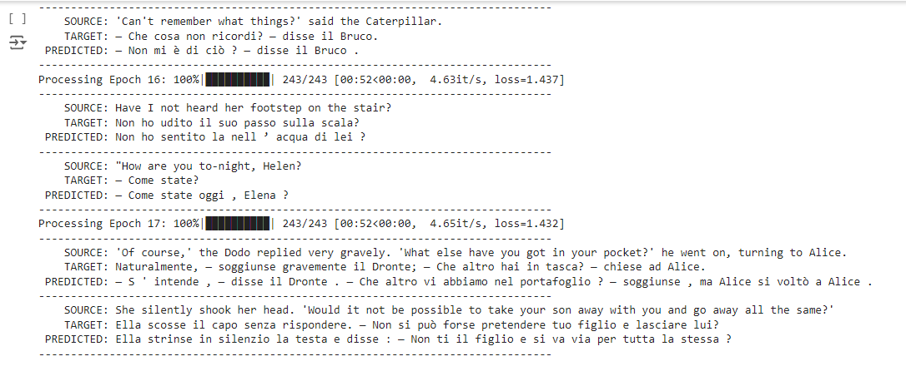

## 🎯 Objective

- Pick the "en-it" dataset from opus_books
- Train your own transformer (E-D) (do anything you want, use PyTorch, OCP, PS, AMP, etc)
- Target loss = <1.8, Max epochs = 18

## 📐 Model Architecture

The transformer model consists of N stacked Encoder-Decoder blocks. Each block features multi-head attention mechanisms, Our transformer comprises 6 (N) Encoder-Decoder blocks. Tokens are embedded into 512-dimensional vectors (d_model). Each block utilizes multi-head attention with 8 (h) heads, followed by feed-forward networks of size 128 (d_ff). The model incorporates positional encodings for sequence context and projects the decoder's output to the target vocabulary for translation.

*Model Dimensions:*

- Embedding Dimension (d_model): This determines the size of the embedding vectors. A common choice is 512.
- Feed-Forward Dimension (d_ff): Determines the size of the internal layers in the feed-forward networks present in both the encoder and decoder blocks.
- Number of Attention Heads (h): Influences how many different attention patterns the model can learn.

## 🔧 Training Optimization

To enhance the model's efficiency and performance:

- Parameter Sharing: The weights between the source and target embeddings are shared. This reduces the number of parameters and aligns the vector spaces, benefiting especially in tasks with closely related languages like English and French.

- AMP (Automatic Mixed Precision): It speeds up training by leveraging both FP16 and FP32 data types, ensuring minimal loss in model accuracy.

- Dynamic Padding: Sequences in each batch are padded dynamically to the length of the longest sequence in that batch, reducing computational overhead.

- One Cycle Policy (OCP): A learning rate scheduling technique that enables faster convergence and potentially better model outcomes.

These optimization techniques together ensure that the model trains faster, requires less memory, and achieves better performance.

## 📈 Results

Final loss after 18 epochs =  1.438

