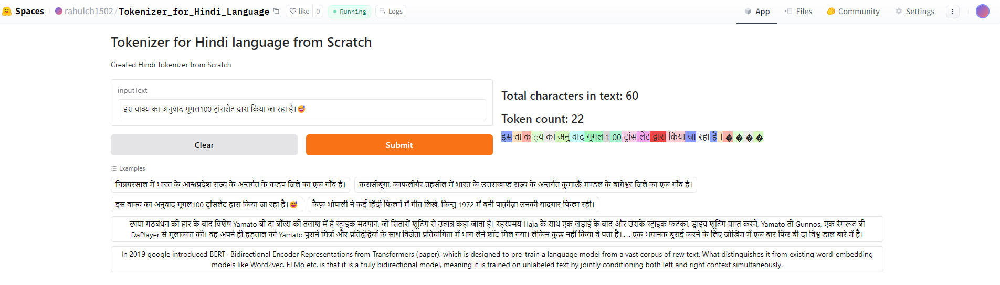

Building a Tokenizer for Hindi Language from Scratch
====================================================

Introduction
------------

### What is a Tokenizer?

A tokenizer is a tool used in natural language processing (NLP) to split text into smaller units called tokens. These tokens can be words, subwords, characters, or other meaningful elements, depending on the specific application.

### Types of Tokenizers

-   **Word Tokenizers**: Split text based on whitespace and punctuation.
-   **Character Tokenizers**: Split text into individual characters.
-   **Subword Tokenizers**: Break text into subwords or units that are smaller than words but larger than characters. Examples include Byte Pair Encoding (BPE) and WordPiece.
-   **Sentence Tokenizers**: Split text into sentences.

### Tokenizers Used by Modern Large Language Models

Modern language models such as BERT, GPT, and T5 commonly use subword tokenizers like BPE or WordPiece. These tokenizers help handle rare words and different word forms efficiently, improving the model's ability to generalize.

### Role of a Tokenizer

A tokenizer converts raw text into tokens, which are numerical representations that a machine learning model can process. Tokenizers are essential in the preprocessing pipeline for training and using NLP models. They help in:

-   Reducing the vocabulary size.
-   Handling out-of-vocabulary words.
-   Improving computational efficiency.

### Why Tokenizers in Multilingual Languages Are Not Readily Available Like for English

Creating tokenizers for multilingual languages is challenging due to:

-   The diversity of scripts and alphabets.
-   The complexity and richness of languages.
-   Limited availability of large, high-quality datasets for many languages.
-   The need for language-specific preprocessing techniques to handle unique linguistic features.

### Demo

Hugginface - https://huggingface.co/spaces/rahulch1502/Tokenizer_for_Hindi_Language



#### Try for yourself!

Code Explanation
----------------

This section provides a step-by-step explanation of the code used to build a tokenizer for the Hindi language from scratch.

### Loading Dataset

We start by loading three text files in Hindi:

-   `hindi_1.txt` (~180MB)
-   `hindi_2.txt` (~45MB)
-   `hindi_3.txt` (~9.3GB, only the first 200,000 lines are used)

```
## Total characters in data files:
length of dataset1 in characters:  71184826
length of dataset2 in characters:  16976318
length of dataset3 in characters:  32497056
```

```
## Main dataset
text = text1 + text2 + text3
print("length of dataset in characters: ", len(text))

## Output
length of dataset in characters:  120658200
```

Building the Vocabulary
Create a vocabulary set by identifying unique characters in the dataset
```
vocab = sorted(list(set(text)))
print('Length of Vocabulary:', len(vocab))

## Output
Length of Vocabulary: 10001
```

Tokenization
Convert the text into a list of tokens by encoding it to UTF-8 and mapping each byte to an integer
```
tokens = text.encode("utf-8")
tokens = list(map(int, tokens))
print("length of text:", len(text))
print("length of tokens:", len(tokens))

## Output
length of text: 120658200
length of tokens: 304795096
```

Pair Statistics
Calculate the frequency of pairs of consecutive tokens
```
def get_stats(ids):
    counts = {}
    for pair in zip(ids, ids[1:]):
        counts[pair] = counts.get(pair, 0) + 1
    return counts

```
Identify the most frequent pair of tokens
```
top_pair = max(stats, key=stats.get)
top_pair

## Output
(224, 164)
```

Convert the most frequent token pair back to characters
```
chr(224), chr(164)

## Output
('à', '¤')
```

Merging Pairs
Define a function to merge frequent pairs in the token list
```
def merge(ids, pair, idx):
    i = 0
    newids = []
    while i < len(ids):
        if i < len(ids) - 1 and ids[i] == pair[0] and ids[i + 1] == pair[1]:
            newids.append(idx)
            i += 2
        else:
            newids.append(ids[i])
            i += 1
    return newids
```

Determine the number of merges to perform
```
num_merges = len(vocab) - 256
num_merges

## Output
9745
```

Perform the merges and build the new token list
```
ids = list(tokens)
merges = {}
for i in range(30):
    stats = get_stats(ids)
    pair = max(stats, key=stats.get)
    idx = 256 + i
    ids = merge(ids, pair, idx)
    merges[pair] = idx

print('Merges completed')
```

Final Statistics
Print the lengths of the original tokens and the new token list, and calculate the compression ratio
```
print("tokens length:", len(tokens))
print("ids length:", len(ids))
print(f"compression ratio: {len(tokens) / len(ids):.2f}X")

## Output
tokens length: 304795096
ids length: 55698259
compression ratio: 5.47X
```

## What is Compression Ratio?
The compression ratio is a measure of how much a dataset has been reduced in size through a process such as tokenization. It is calculated by dividing the original size of the data (in this case, the number of tokens before merging) by the size of the compressed data (the number of tokens after merging).

## Significance of Compression Ratio
- Efficiency: A higher compression ratio indicates that the tokenizer has effectively reduced the number of tokens, which can lead to more efficient processing. This is important for both storage and computational efficiency. Smaller token sets require less memory and faster processing times, which is crucial for large-scale NLP applications.
- Model Performance: Reducing the number of tokens can help in training models more effectively. A smaller, more compact token set can improve the generalization ability of the model and potentially lead to better performance on various NLP tasks.
- Handling Rare Words: A good compression ratio means the tokenizer is effectively merging frequent pairs, which can help in handling rare words. Instead of treating each rare word as a unique token, the tokenizer breaks down words into subwords or characters that are more common, improving the model's ability to handle diverse vocabulary.
- Scalability: For large datasets, an effective compression ratio is essential to scale the NLP system. As the size of the data grows, maintaining a manageable token set is critical to ensure the system remains scalable and responsive.

## Results

### Dataset Statistics
The initial step involved loading and analyzing the three text files in Hindi. The lengths of these datasets in characters are as follows:

- Dataset 1 (hindi_1.txt): 71,184,826 characters
- Dataset 2 (hindi_2.txt): 16,976,318 characters
- Dataset 3 (hindi_3.txt): 32,497,056 characters (first 200,000 lines)

Combining these datasets resulted in a total length of 120,658,200 characters.

### Vocabulary
The vocabulary was constructed by identifying unique characters in the combined text. The length of the vocabulary was found to be:

- Vocabulary Size: 10,001 unique characters

### Tokenization
The text was then converted into a list of tokens by encoding it to UTF-8 and mapping each byte to an integer:

- Length of Text: 120,658,200 characters
- Length of Tokens: 304,795,096 tokens

### Pair Statistics
To optimize the tokenization process, we calculated the frequency of pairs of consecutive tokens and identified the most frequent pairs. This step is crucial for understanding the common sequences in the dataset.

### Merging Pairs
The merging process was conducted over 30 iterations to progressively combine the most frequent pairs. The goal was to reduce the number of tokens while maintaining the integrity of the text information. The number of merges was determined based on the size of the vocabulary minus a base index:

- Number of Merges: 9,745 (length of vocabulary minus 256)

### Compression Ratio
After performing the merges, the final lengths of the original and compressed token lists were:

- Original Tokens Length: 304,795,096 tokens
- Compressed Tokens Length: 55,698,259 tokens
- #### Compression Ratio: 5.47X
This compression ratio indicates a significant reduction in the number of tokens, demonstrating the efficiency of the merging process.

## Conclusion
The results demonstrate the effectiveness of the tokenizer built from scratch for the Hindi language. By carefully analyzing the dataset, constructing a robust vocabulary, and efficiently merging token pairs, we achieved a substantial compression ratio. This paves the way for creating efficient, scalable, and high-performing NLP models for Hindi and other multilingual languages.
