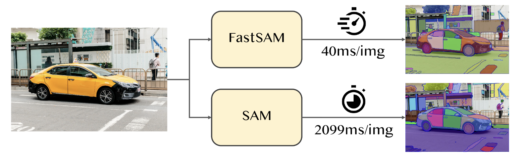

# [1. Document Edge Detection using FastSAM](https://huggingface.co/spaces/rahulch1502/FastSam-Document-Cropping) 🔗

The Fast Segment Anything Model(FastSAM) is a CNN Segment Anything Model trained using only 2% of the SA-1B dataset published by SAM authors. FastSAM achieves comparable performance with the SAM method at 50× higher run-time speed.

---

### [FastSAM](https://github.com/CASIA-IVA-Lab/FastSAM) vs SAM

---

### Types of Prompt in FastSAM

---

### Model Checkpoints

Two model versions of the model are available with different sizes. Click the links below to download the checkpoint for the corresponding model type.
- default or FastSAM: [YOLOv8x based Segment Anything Model](https://drive.google.com/file/d/1m1sjY4ihXBU1fZXdQ-Xdj-mDltW-2Rqv/view?usp=sharing)
- FastSAM-s: [YOLOv8s based Segment Anything Model](https://drive.google.com/file/d/10XmSj6mmpmRb8NhXbtiuO9cTTBwR_9SV/view?usp=sharing)

In below demo I have made used of default or FastSAM model

---

### FastSAM for Document Edge Detection:

[Demo](https://huggingface.co/spaces/rahulch1502/FastSam-Document-Cropping) 🔗

As seen in above image, without any custom training FastSAM is able to identify the document while ignoring the background. Hence this model can be used for cropping and removing background from images.

---

### References

1.) [FastSAM] (https://github.com/CASIA-IVA-Lab/FastSAM)
