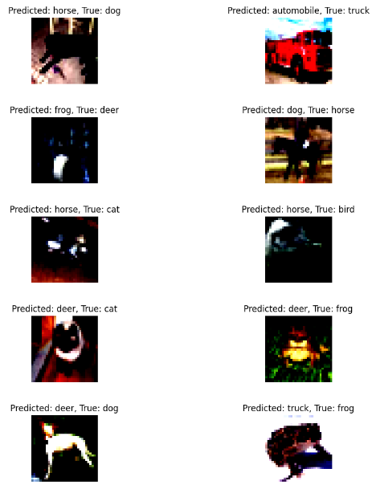

# Analysis of Normalization Techniques on CIFAR Dataset

## Overview:
In this project, we implemented and compared the performance of three normalization techniques, namely Batch Normalization, Layer Normalization, and Group Normalization, on the CIFAR dataset. Each technique was applied to a convolutional neural network (CNN), and their respective performances were evaluated in terms of test accuracy and model parameters.

## Experimental Setup:

- Dataset: CIFAR (Canadian Institute for Advanced Research) dataset, consisting of 60,000 32x32 color images in 10 classes.
- Model: Convolutional Neural Network (CNN) architecture.
- Normalization Techniques: Batch Normalization, Layer Normalization, and Group Normalization.

## Findings:
Based on the experiments conducted, the following observations were made:

- Batch Normalization (BN):

  - Parameters: 48k
  - Test Accuracy (1st run): 74.30%
  - Test Accuracy (2nd run): 72.24%
  - Batch normalization yielded relatively high test accuracy, indicating effective stabilization of the training process. However, there was a slight decrease in accuracy in the second run, suggesting some sensitivity to variations in training.
  - Misclassified Images:
    
   

  - Loss Graph

   

- Layer Normalization (LN):

  - Parameters: 50k
  - Test Accuracy (1st run): 54.96%
  - Test Accuracy (2nd run): 55.69%
  - Layer normalization resulted in lower test accuracy compared to batch normalization. However, it exhibited no signs of overfitting, which could be advantageous in certain scenarios.
  - Misclassified images -
 
    

  - Loss Graph

    

- Group Normalization (GN):

  - Parameters: 48k
  - Test Accuracy (1st run): 73.40%
  - Test Accuracy (2nd run): 71.23%
  - Group normalization showed performance similar to batch normalization in terms of test accuracy. It also maintained consistency across runs, indicating robustness to variations in training.
  - Misclassified Images:

   

  - Loss Graph
 
   

## Conclusion:

- Batch Normalization demonstrated the highest test accuracy among the three techniques, although it exhibited some sensitivity to variations in training.
- Layer Normalization, while not achieving the highest accuracy, showed no signs of overfitting, which could be beneficial for certain applications.
- Group Normalization provided a viable alternative to batch normalization, offering competitive performance with robustness to training variations.
